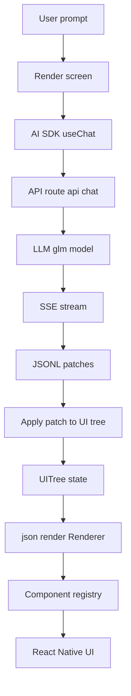
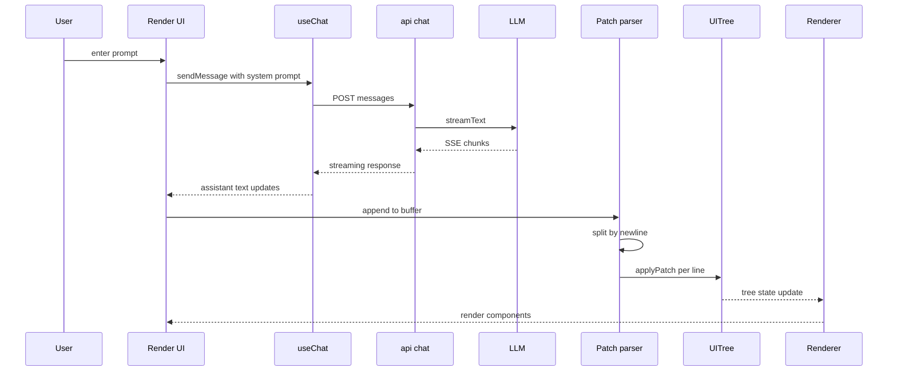

# Expo JSON Render

基于 Expo Router 的 React Native 应用，支持 AI 驱动的 JSON 仪表板生成和 AI 聊天功能。

## 技术栈

- **Expo SDK** ~54.0.31 (React Native 0.81.5)
- **React** 19.1.0
- **Expo Router** v6 (文件路由 + Native Tabs 导航)
- **@json-render/core** & **@json-render/react** - JSON 驱动的 UI 渲染
- **Vercel AI SDK** - AI 聊天集成
- **GLM-4.7** - 智谱 AI 大模型（可替换为其他模型）
- **Zod** - 组件 schema 验证
- **TypeScript** (严格模式)
- **Bun** - 包管理器

## 参考资料

本项目灵感来源于以下优秀项目：

- [vercel-labs/json-render](https://github.com/vercel-labs/json-render) - JSON 驱动的 UI 渲染核心库
- [Vercel AI SDK - Expo 入门](https://ai-sdk.dev/docs/getting-started/expo) - Expo 集成 AI SDK 指南
- [Expo 官方文档](https://docs.expo.dev/) - Expo 开发框架文档
- [Vercel AI SDK - 选择模型提供商](https://ai-sdk.dev/docs/getting-started/choosing-a-provider) - 支持多种 AI 模型提供商

## 功能特性

### AI 仪表板生成器

通过自然语言描述自动生成 React Native 仪表板界面。只需输入如 "Revenue dashboard with metrics and chart" 的提示，AI 将实时流式输出并渲染对应的 UI 组件。

**核心特性：**

- 15 种内置组件（Card、Grid、Stack、Metric、Chart、Table、Button 等）
- JSONL (JSON Lines) 增量渲染，实时显示组件
- 数据绑定支持（valuePath、dataPath、bindPath）
- 快速提示模板
- AI 输出查看器（Patches/Tree 双视图）

**可用组件：**

| 组件       | 描述               | 主要属性                         |
| ---------- | ------------------ | -------------------------------- |
| Card       | 带标题/描述的容器  | title, description, padding      |
| Grid       | 网格布局（1-4 列） | columns, gap                     |
| Stack      | 弹性布局容器       | direction, gap, align            |
| Metric     | 数值指标展示       | label, valuePath, format, trend  |
| Chart      | 条形图可视化       | type, dataPath, title, height    |
| Table      | 数据表格           | title, dataPath, columns         |
| Button     | 操作按钮           | label, variant, action, disabled |
| Select     | 单选样式选择器     | label, bindPath, options         |
| DatePicker | 日期输入框         | label, bindPath, placeholder     |
| Heading    | 标题文本（h1-h4）  | text, level                      |
| Text       | 段落文本           | content, variant, color          |
| Badge      | 状态徽章           | text, variant                    |
| Alert      | 提示横幅           | type, title, message             |
| Divider    | 分割线             | label                            |
| Empty      | 空状态展示         | title, description               |

### 标签页导航

- **首页** - 应用主页面
- **渲染** - AI 驱动的 JSON 仪表板生成器
- **聊天机器人** - AI 对话界面

### AI 聊天

集成智谱 GLM-4.7 大模型，支持流式响应：

- API 端点：`/api/chat`
- 使用 Vercel AI SDK 实现流式传输
- 需配置 `GLM_API_KEY` 环境变量

### 模型替换

本项目默认使用智谱 GLM-4.7 模型，但你可以轻松替换为其他 AI 模型提供商。Vercel AI SDK 支持多种模型，包括：

- **OpenAI**
- **Anthropic**
- **Google**
- **其他** - Mistral、Hugging Face、Azure OpenAI 等

替换步骤：

1. 安装对应提供商的包（如 `bun add @ai-sdk/openai`）
2. 修改 `src/app/api/chat+api.ts` 中的模型配置
3. 更新环境变量（如 `OPENAI_API_KEY`、`ANTHROPIC_API_KEY`）

详细配置请参考：[Vercel AI SDK - 选择模型提供商](https://ai-sdk.dev/docs/getting-started/choosing-a-provider)

## 开始使用

### 环境准备

1. 安装依赖：

```bash
bun install
```

2. 配置环境变量：

```bash
cp .env.example .env
```

编辑 `.env` 文件，填入你的 API 密钥：

```
GLM_API_KEY=your_api_key_here
```

### 开发

```bash
# 启动开发服务器
bun start

# 指定平台启动
bun run android    # Android
bun run ios        # iOS
bun run web        # Web
```

### 代码质量检查

```bash
# 运行 ESLint
bun run lint

# TypeScript 类型检查
bun run typecheck
```

## 项目结构

```
expo-json-render/
├── src/
│   ├── app/                    # Expo Router 文件路由
│   │   ├── _layout.tsx        # 根布局
│   │   ├── (tabs)/            # 标签页导航组
│   │   │   ├── _layout.tsx    # 标签页布局
│   │   │   ├── index.tsx      # 首页
│   │   │   ├── render/        # AI 仪表板生成器
│   │   │   │   ├── index.tsx              # 主界面
│   │   │   │   ├── registry.tsx            # 组件注册表（15 个组件）
│   │   │   │   ├── dashboardCatalog.ts     # 组件 schema 目录
│   │   │   │   ├── useDashboardTreeStream.ts # JSONL 流解析器
│   │   │   │   └── initialData.ts          # 示例数据
│   │   │   └── chatbot/       # AI 聊天功能
│   │   └── api/               # API 路由
│   │       └── chat+api.ts    # 聊天流式接口
│   └── utils/                 # 工具函数
│       └── urlGenerator.ts    # API URL 生成
├── assets/
│   └── images/                # 应用图标、启动页
├── .env                       # 环境变量（不提交）
├── .env.example              # 环境变量模板
└── [配置文件]
```

## AI 仪表板生成器工作原理

1. 用户输入自然语言描述（如 "Revenue dashboard with metrics and chart"）
2. AI 通过流式输出 JSONL (JSON Lines) 补丁
3. 补丁被增量解析并应用到 UI 树
4. 组件通过 `@json-render/react` 库渲染

## 实现细节

本项目的 Render tab 实现目标是复刻 `json-render` 的 `examples/dashboard` 思路, 但渲染目标从 DOM 变成 React Native 组件.

### json-render 的原理概览

json-render 的核心是把 UI 从 "自由文本" 变成 "受限 JSON tree":

- Catalog: 用 Zod 定义允许的组件类型与 props schema, 也就是 AI 的受限 vocabulary
- UI Tree: 扁平结构 `UITree` + `UIElement` map, children 只引用 key, 便于 streaming 增量构建
- Registry: 把 `element.type` 映射到真实的 React component, 并通过 providers 提供 data binding, actions, visibility 等能力
- Streaming: AI 输出 JSONL patches, client 按行解析 patch 并应用到 tree, UI 随 tree 变化实时渲染

#### Data flow



### 如何移植到 React Native

移植的关键点不是改 core, 而是处理渲染目标与 streaming 通道:

1. 复用 `@json-render/core` 和 `@json-render/react`

- `@json-render/core` 负责 types, patch 模型, data path 读写等纯逻辑
- `@json-render/react` 提供 `Renderer` 与 `DataProvider` `ActionProvider` `VisibilityProvider` `ValidationProvider`

2. 用 RN 组件实现 registry

- Web 版本里 `Card` `Grid` `Stack` 依赖 CSS, RN 版本用 `View` `Text` `Pressable` + Flexbox 实现
- `Table` 用 `ScrollView horizontal` 做简化展示, `Chart` 用简化柱状图占位实现

3. 用 AI SDK 在 Expo 消费 streaming

- `useChat` + `DefaultChatTransport` + `expo/fetch` 负责稳定消费 stream
- client 端把 assistant text 当作 "JSONL patch 流", 按行解析并更新 `UITree`

4. 替换 Confirm UI

- `@json-render/react` 自带的 DOM `ConfirmDialog` 不适用于 RN
- 本项目用 `Alert.alert` 实现 `pendingConfirmation` 的 confirm flow

#### Streaming patch apply



### 代码对应关系

- Catalog 与组件列表
  - `src/app/(tabs)/render/dashboardCatalog.ts`
  - 作用: 定义可用组件与 props schema, 并导出 `componentList` 作为 system prompt 的可选组件集合
- 初始数据与 data binding
  - `src/app/(tabs)/render/initialData.ts`
  - 作用: 提供 demo data, AI 通过 `valuePath` `dataPath` `bindPath` 引用数据
- Registry
  - `src/app/(tabs)/render/registry.tsx`
  - 作用: 把 `type` 映射为 RN 组件, 并实现最小可用的 dashboard UI
- JSONL 流解析与 patch 应用
  - `src/app/(tabs)/render/useDashboardTreeStream.ts`
  - 作用: 从 assistant text 增量提取新增内容, `buffer + split by \\n + JSON.parse` 得到 patch, 然后 `applyPatch` 更新 tree
- Render 页面与 output sheet
  - `src/app/(tabs)/render/index.tsx`
  - 作用: 注入 system prompt, 发送用户 prompt, 实时渲染 tree, 并用底部 sheet 展示 Patches 与 Tree

**快速提示示例：**

- "Revenue dashboard with metrics and chart" - 收入仪表板
- "Recent transactions table with status badges" - 最近交易表格
- "Customer and orders overview with filters" - 客户和订单概览
- "Sales by region chart and key metrics" - 区域销售图表

**数据绑定：**

- `valuePath`: "/analytics/revenue" - 读取单个值
- `dataPath`: "/analytics/salesByRegion" - 读取数组用于图表/表格
- `bindPath`: "/form/region" - 表单输入的双向绑定

## 环境变量

| 变量                       | 说明                  | 必填 |
| -------------------------- | --------------------- | ---- |
| `GLM_API_KEY`              | 智谱 AI API 密钥      | 是   |
| `EXPO_PUBLIC_API_BASE_URL` | 生产环境 API 基础 URL | 否   |

## 组件注册系统

应用使用 `@json-render/react` 的组件注册系统：

1. **注册表** (`registry.tsx`): 将组件类型名映射到 React 组件
2. **目录** (`dashboardCatalog.ts`): 定义组件属性的 Zod schema
3. **渲染器**: 从树结构渲染 UI 元素，支持数据绑定

**数据提供器：**

- `DataProvider` - 通过 `useData()` hook 提供数据
- `VisibilityProvider` - 控制组件可见性
- `ActionProvider` - 处理按钮操作和确认对话框
- `ValidationProvider` - 验证组件属性

## API URL 配置

`urlGenerator.ts` 工具自动处理 API URL 构建：

- **开发环境**：使用 `Constants.experienceUrl` 构建本地 API URL
- **生产环境**：需配置 `EXPO_PUBLIC_API_BASE_URL` 环境变量

## Expo 实验性功能

- New Architecture
- Typed Routes
- React Compiler
- Static Web Output

## 路径别名

- `@/*` 映射到项目根目录（在 `tsconfig.json` 中配置）

## License

MIT
