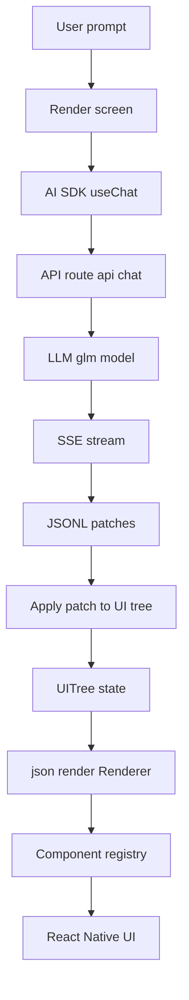
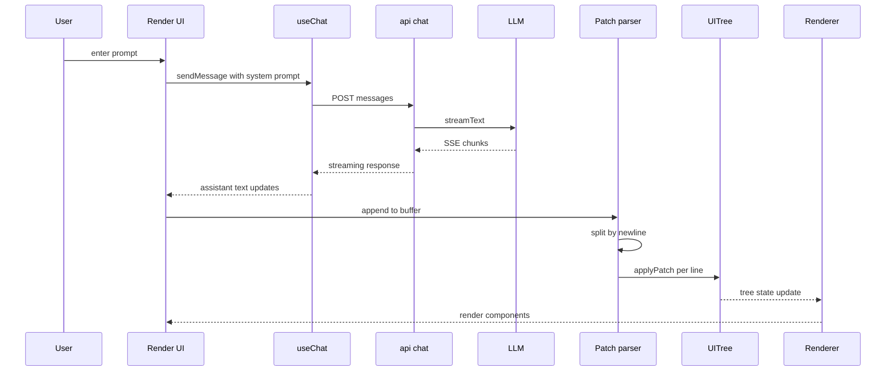

# Expo JSON Render

**English | [中文](README-zh.md)**

A React Native app built with Expo Router featuring AI-powered JSON dashboard generation, interactive TodoList, and AI chat capabilities.

## Tech Stack

- **Expo SDK** ~54.0.31 (React Native 0.81.5)
- **React** 19.1.0
- **Expo Router** v6 (file-based routing + Native Tabs navigation)
- **@json-render/core** & **@json-render/react** - JSON-driven UI rendering
- **Vercel AI SDK** - AI chat integration with tool calling support
- **GLM-4.7** - Zhipu AI large language model (swappable with other models)
- **Zod** v4 - Component schema validation
- **Tailwind CSS** v4 + **uniwind** - Universal styling for React Native
- **TypeScript** (strict mode)
- **Bun** - Package manager

## References

This project is inspired by the following excellent resources:

- [vercel-labs/json-render](https://github.com/vercel-labs/json-render) - Core library for JSON-driven UI rendering
- [Vercel AI SDK - Expo Getting Started](https://ai-sdk.dev/docs/getting-started/expo) - Guide for integrating AI SDK with Expo
- [Expo Documentation](https://docs.expo.dev/) - Official Expo development framework docs
- [Vercel AI SDK - Choosing a Provider](https://ai-sdk.dev/docs/getting-started/choosing-a-provider) - Multiple AI model providers supported

## Features

### AI Dashboard Generator

Automatically generate React Native dashboard interfaces from natural language descriptions. Simply enter a prompt like "Revenue dashboard with metrics and chart" and the AI will stream and render the corresponding UI components in real-time.

**Core Features:**

- 15 built-in components (Card, Grid, Stack, Metric, Chart, Table, Button, etc.)
- JSONL (JSON Lines) incremental rendering with real-time component display
- Data binding support (valuePath, dataPath, bindPath)
- Quick prompt templates
- AI output viewer (Patches/Tree dual view)

**Available Components:**

| Component  | Description                      | Main Props                       |
| ---------- | -------------------------------- | -------------------------------- |
| Card       | Container with title/description | title, description, padding      |
| Grid       | Grid layout (1-4 columns)        | columns, gap                     |
| Stack      | Flex layout container            | direction, gap, align            |
| Metric     | Numeric metric display           | label, valuePath, format, trend  |
| Chart      | Bar chart visualization          | type, dataPath, title, height    |
| Table      | Data table                       | title, dataPath, columns         |
| Button     | Action button                    | label, variant, action, disabled |
| Select     | Radio-style selector             | label, bindPath, options         |
| DatePicker | Date input field                 | label, bindPath, placeholder     |
| Heading    | Heading text (h1-h4)             | text, level                      |
| Text       | Paragraph text                   | content, variant, color          |
| Badge      | Status badge                     | text, variant                    |
| Alert      | Alert banner                     | type, title, message             |
| Divider    | Section divider                  | label                            |
| Empty      | Empty state display              | title, description               |

### AI TodoList Generator

Standalone component showcase for JSON-driven todo/task management interfaces. Similar to the Dashboard Generator, it uses AI to generate interactive UI components from natural language descriptions.

**Core Features:**

- 8 built-in components (Title, Text, Table, Checkbox, Button, Confirm, Waiting, Input, Stack)
- JSONL (JSON Lines) incremental rendering with real-time component display
- Interactive todo list with show/hide completed toggle
- Demo mode with pre-built component showcase
- Mock data loading for testing

**Available Components:**

| Component  | Description                      | Main Props                                |
| ---------- | -------------------------------- | ----------------------------------------- |
| Title      | Heading text                     | text                                      |
| Text       | Text paragraph with variants     | content, variant (default/muted/success/warning/danger) |
| Table      | Interactive todo list            | dataPath, showCompletedPath                |
| Checkbox   | Checkbox input                   | label, bindPath                           |
| Button     | Action button                    | label, variant (primary/secondary/danger), action |
| Confirm    | Button with confirmation dialog  | label, action, confirm (title, message)    |
| Waiting    | Loading spinner with text        | text                                      |
| Input      | Text input field                 | label, bindPath, placeholder               |
| Stack      | Flex layout container            | gap (sm/md/lg), direction, align           |

**Quick Prompts:**

- "Simple todo list with checkboxes"
- "Task manager with categories"
- "Daily planner with time slots"
- "Shopping checklist with sections"

### Tab Navigation

- **Dashboard** - AI-powered JSON dashboard generator with 15 components
- **TodoList** - Standalone TodoList component showcase with AI generation
- **Chatbot** - AI chat interface with interactive TodoList tool calling

### AI Chatbot with TodoList Tool

Interactive chat interface powered by GLM-4.7 with AI tool calling:

**Core Features:**

- Streaming chat responses via Vercel AI SDK
- Interactive TodoList UI card component
- AI automatically detects todo-related requests
- Multi-select suggestions for quick task addition
- Custom todo input with action buttons
- Show/hide completed tasks toggle

**TodoList UI Components:**

| Component  | Description                      | Props                         |
| ---------- | -------------------------------- | ----------------------------- |
| Title      | Heading text                     | text                          |
| Text       | Paragraph with variant support   | content, variant              |
| Table      | Interactive todo list            | dataPath, showCompletedPath   |
| Checkbox   | Checkbox input                   | label, bindPath               |
| Button     | Action button                    | label, variant, action        |
| Input      | Text input field                 | label, bindPath, placeholder  |
| Stack      | Flex layout container            | gap, direction, align         |

**Quick Prompts:**

- "What is React Native?"
- "Explain Expo Router"
- "How to use Tailwind in React Native?"
- "What is JSON rendering?"
- "Show my todo list and suggest tasks"

**Tool Integration:**

- API endpoint: `/api/chatbot`
- Custom `todo_ui` tool for rendering interactive UI cards
- Requires `GLM_API_KEY` environment variable

### Model Replacement

This project uses Zhipu GLM-4.7 by default, but you can easily switch to other AI model providers. The Vercel AI SDK supports various models including:

- **OpenAI**
- **Anthropic**
- **Google**
- **Others** - Mistral, Hugging Face, Azure OpenAI, etc.

**Steps to switch:**

1. Install the corresponding provider package (e.g., `bun add @ai-sdk/openai`)
2. Modify the model configuration in `src/app/api/chat+api.ts`
3. Update environment variables (e.g., `OPENAI_API_KEY`, `ANTHROPIC_API_KEY`)

For detailed configuration, see: [Vercel AI SDK - Choosing a Provider](https://ai-sdk.dev/docs/getting-started/choosing-a-provider)

## Getting Started

### Prerequisites

1. Install dependencies:

```bash
bun install
```

2. Configure environment variables:

```bash
cp .env.example .env
```

Edit `.env` file and add your API key:

```
GLM_API_KEY=your_api_key_here
```

### Development

```bash
# Start development server
bun start

# Platform-specific start
bun run android    # Android
bun run ios        # iOS
bun run web        # Web
```

### Code Quality

```bash
# Run ESLint
bun run lint

# TypeScript type checking
bun run typecheck
```

## Project Structure

```
expo-json-render/
├── src/
│   ├── app/                    # Expo Router file-based routing
│   │   ├── _layout.tsx        # Root layout
│   │   ├── (tabs)/            # Tabs navigator group
│   │   │   ├── _layout.tsx    # Tabs layout
│   │   │   ├── dashboard/     # AI Dashboard Generator (page only)
│   │   │   │   ├── _layout.tsx # Dashboard layout
│   │   │   │   └── index.tsx   # Main interface
│   │   │   ├── todolist/      # TodoList component showcase
│   │   │   │   └── index.tsx   # TodoList interface
│   │   │   └── chatbot/       # AI Chatbot with TodoList
│   │   │       ├── _layout.tsx # Chatbot layout
│   │   │       └── index.tsx   # Chat interface
│   │   └── api/               # API routes
│   │       ├── chat+api.ts    # Dashboard/TodoList chat streaming
│   │       └── chatbot+api.ts # Chatbot with tool calling
│   ├── components/            # Reusable components
│   │   ├── chatbot/           # Chatbot components
│   │   │   └── TodoAssistantCard.tsx # Interactive UI card
│   │   ├── dashboard/         # Dashboard components
│   │   │   ├── registry.tsx   # Component registry (15 components)
│   │   │   └── dashboardCatalog.ts # Component schema catalog
│   │   └── todolist/          # TodoList components
│   │       └── registry.tsx   # TodoList component registry (8 components)
│   ├── hooks/                 # Custom React hooks
│   │   ├── useDashboardTreeStream.ts # JSONL stream parser
│   │   └── useTodolistTreeStream.ts  # TodoList JSONL parser
│   ├── lib/                   # Library code
│   │   ├── chatbot/           # Chatbot library
│   │   │   └── systemPrompt.ts # Chatbot system prompt
│   │   ├── dashboard/         # Dashboard library
│   │   │   ├── systemPrompt.ts # AI system prompt generator
│   │   │   ├── initialData.ts  # Sample data
│   │   │   └── mockPatches.ts  # Mock JSONL patches
│   │   └── todolist/          # TodoList library
│   │       ├── systemPrompt.ts     # TodoList system prompt
│   │       ├── initialData.ts      # Sample data
│   │       ├── mockPatches.ts      # Mock JSONL patches
│   │       └── todoAssistantTool.ts # Todo UI tool & tree builder
│   └── utils/                 # Utility functions
│       └── urlGenerator.ts    # API URL generation
├── assets/
│   └── images/                # App icons, splash screens
├── .env                       # Environment variables (not committed)
├── .env.example              # Environment variables template
└── [config files]
```

## How AI Dashboard Generator Works

1. User enters a natural language description (e.g., "Revenue dashboard with metrics and chart")
2. AI streams JSONL (JSON Lines) patches
3. Patches are incrementally parsed and applied to a UI tree
4. Components are rendered via the `@json-render/react` library

## Implementation Details

The Render tab implementation aims to replicate `json-render`'s `examples/dashboard` approach, but with React Native components as the rendering target instead of DOM.

### json-render Principles Overview

The core of json-render is transforming UI from "free text" to "restricted JSON tree":

- **Catalog**: Uses Zod to define allowed component types and props schema - the AI's restricted vocabulary
- **UI Tree**: Flat structure `UITree` + `UIElement` map, children only reference keys for streaming incremental construction
- **Registry**: Maps `element.type` to real React components, provides data binding, actions, visibility via providers
- **Streaming**: AI outputs JSONL patches, client parses patches by line and applies to tree, UI renders in real-time as tree changes

#### Data Flow



### Porting to React Native

The key to porting is not modifying core, but handling the rendering target and streaming channel:

1. **Reuse `@json-render/core` and `@json-render/react`**
   - `@json-render/core` handles types, patch models, data path read/write (pure logic)
   - `@json-render/react` provides `Renderer`, `DataProvider`, `ActionProvider`, `VisibilityProvider`, `ValidationProvider`

2. **Implement registry with RN components**
   - Web version's `Card`, `Grid`, `Stack` depend on CSS; RN version uses `View`, `Text`, `Pressable` + Flexbox
   - `Table` uses `ScrollView horizontal` for simplified display, `Chart` uses simplified bar chart placeholder

3. **Use AI SDK in Expo to consume streaming**
   - `useChat` + `DefaultChatTransport` + `expo/fetch` for stable stream consumption
   - Client treats assistant text as "JSONL patch stream", parses by line and updates `UITree`

4. **Replace Confirm UI**
   - `@json-render/react`'s built-in DOM `ConfirmDialog` doesn't work in RN
   - This project uses `Alert.alert` to implement `pendingConfirmation` confirm flow

#### Streaming Patch Apply



### Code Correspondence

- **Catalog and component list**
  - `src/components/dashboard/dashboardCatalog.ts`
  - Purpose: Defines available components and props schema, exports `componentList` as system prompt's optional component set
- **System prompt**
  - `src/lib/dashboard/systemPrompt.ts`
  - Purpose: Generates the AI system prompt with component details and rules
- **Initial data and data binding**
  - `src/lib/dashboard/initialData.ts`
  - Purpose: Provides demo data, AI references data via `valuePath`, `dataPath`, `bindPath`
- **Registry**
  - `src/components/dashboard/registry.tsx`
  - Purpose: Maps `type` to RN components, implements minimal usable dashboard UI
- **JSONL stream parsing and patch application**
  - `src/hooks/useDashboardTreeStream.ts`
  - Purpose: Incrementally extracts new content from assistant text, `buffer + split by \n + JSON.parse` to get patch, then `applyPatch` updates tree
- **Render page and output sheet**
  - `src/app/(tabs)/dashboard/index.tsx`
  - Purpose: Injects system prompt, sends user prompt, renders tree in real-time, displays Patches and Tree via bottom sheet

**Quick Prompt Examples:**

- "Revenue dashboard with metrics and chart" - Revenue dashboard
- "Recent transactions table with status badges" - Recent transactions table
- "Customer and orders overview with filters" - Customer and orders overview
- "Sales by region chart and key metrics" - Regional sales chart

**Data Binding:**

- `valuePath`: "/analytics/revenue" - Read a single value
- `dataPath`: "/analytics/salesByRegion" - Read an array for charts/tables
- `bindPath`: "/form/region" - Two-way binding for form inputs

## Environment Variables

| Variable                   | Description             | Required |
| -------------------------- | ----------------------- | -------- |
| `GLM_API_KEY`              | Zhipu AI API key        | Yes      |
| `EXPO_PUBLIC_API_BASE_URL` | Production API base URL | No       |

## Component Registry System

The app uses `@json-render/react`'s component registry system:

1. **Registry** (`src/components/dashboard/registry.tsx`): Maps component type names to React components
2. **Catalog** (`src/components/dashboard/dashboardCatalog.ts`): Defines Zod schemas for component props
3. **Renderer**: Renders UI elements from a tree structure with data binding support

**Data Providers:**

- `DataProvider` - Supplies data via `useData()` hook
- `VisibilityProvider` - Controls component visibility
- `ActionProvider` - Handles button actions and confirmation dialogs
- `ValidationProvider` - Validates component props

## API URL Configuration

The `urlGenerator.ts` utility handles API URL construction:

- **Development**: Uses `Constants.experienceUrl` to construct local API URLs
- **Production**: Requires `EXPO_PUBLIC_API_BASE_URL` environment variable

## Expo Experimental Features

- New Architecture
- Typed Routes
- React Compiler
- Static Web Output

## Path Aliases

- `@/*` maps to the project root directory (configured in `tsconfig.json`)

## License

MIT
